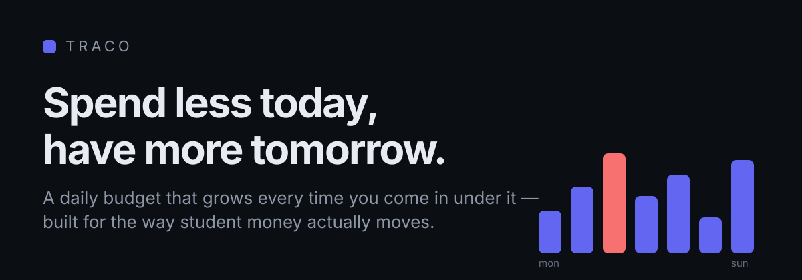
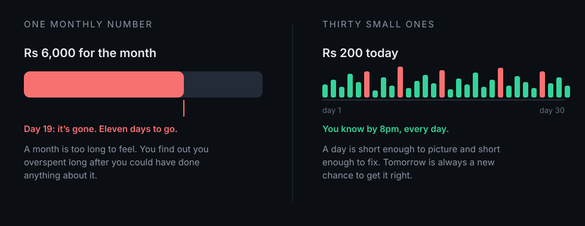
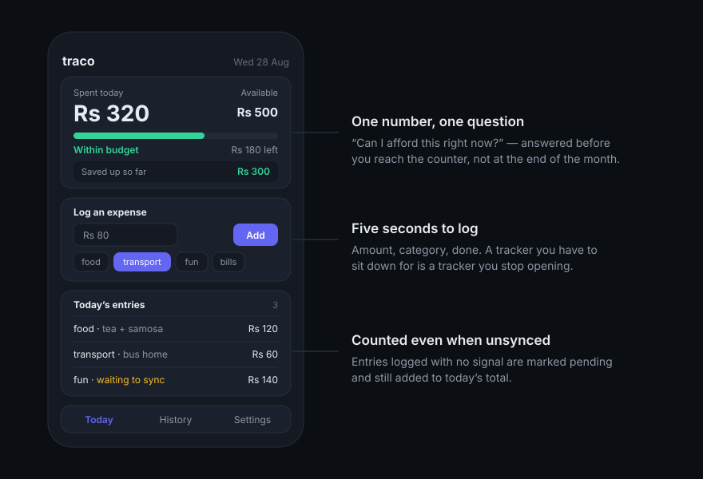
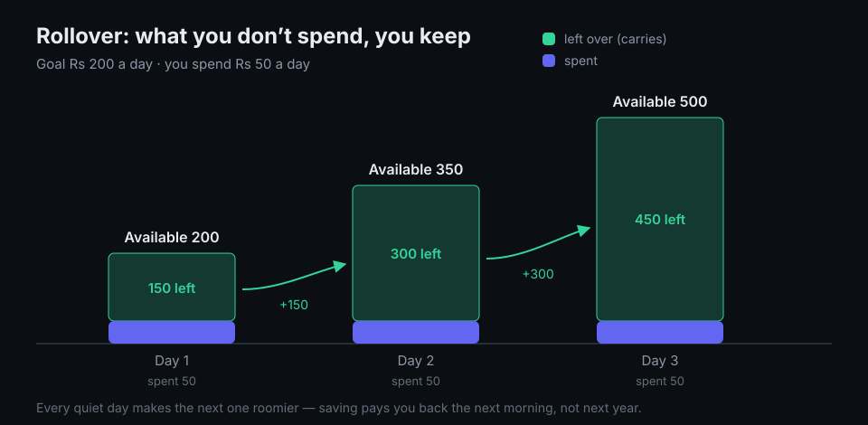
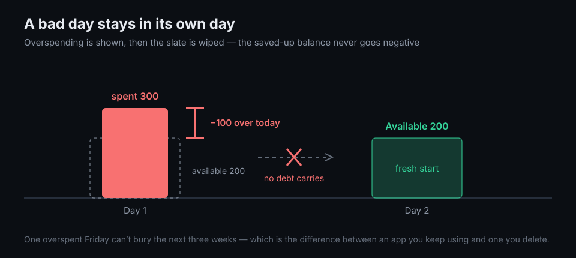
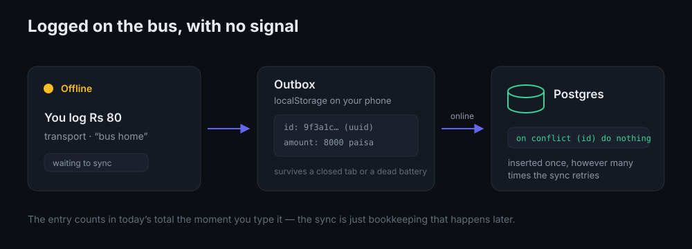

# Why traco matters for students

Most budgeting apps were designed for someone with a salary, a bank card, and a
month that starts on the 1st. Students have none of those things. They have an
allowance that arrives whenever it arrives, a wallet that leaks in Rs 40
increments, and a month that quietly ends on the 19th.

traco is built for that. This is what it does differently, and why each of those
differences matters if you're a student.

---

## 1. The problem isn't overspending. It's finding out too late.

Ask a student where their money went last month and you'll usually get an honest
shrug. Not because they were reckless — because nothing about a monthly number
gives feedback while there's still time to act on it. You get one signal, at the
end, when the only available response is regret.

A day is different. A day is short enough to picture before it starts and short
enough to correct while it's happening. If you know at 4pm that you've spent
Rs 320 of Rs 500, that isn't a report — it's a decision you can still make.

traco's entire screen answers one question: **can I afford this, right now?**

---

## 2. One screen, one number, five seconds to log

The fastest way to kill a tracking habit is to make tracking feel like homework.
Students already have homework.

So logging an expense in traco is an amount, a category, and an optional note —
that's it. Eight categories (food, transport, groceries, shopping, bills,
health, fun, other), a tap, done. No receipts, no accounts to reconcile, no
onboarding wizard asking you to classify your financial goals.

Above the form sits the only number that matters today: what you've spent, what
you have, and a bar that goes green → amber → red as the day fills up. The
colour is doing the work. You don't read the app; you glance at it.

---

## 3. Saving pays you back tomorrow morning, not in ten years

This is the part that makes traco different from a spreadsheet, and it's the
part that matters most for students.

Every normal budgeting app punishes you for overspending. Almost none of them
*reward* you for underspending — you skip the cafeteria, cook rice in the
hostel, and your reward is… a slightly smaller number in a column. Nothing
happens. Discipline with no payoff is discipline you abandon by Thursday.

In traco, whatever you don't spend is added to tomorrow's budget:

| Day | Goal | Carried in | Available | Spent | Result |
| --- | ---: | ---: | ---: | ---: | --- |
| 1 | 200 | 0 | **200** | 50 | +150 carries |
| 2 | 200 | 150 | **350** | 50 | +300 carries |
| 3 | 200 | 300 | **500** | 50 | +450 carries |

Skipping a Rs 150 lunch isn't an abstract virtue any more. It's Rs 150 sitting
in tomorrow's budget with your name on it. Three quiet days and you can afford
the concert on Saturday without borrowing from anyone or feeling bad about it.

That's the actual skill worth learning at 19: **not "spend less" — "spend later,
on purpose."** traco makes the trade visible enough to be tempting.

> If you'd rather judge each day on its own, rollover can be switched off in
> Settings.

---

## 4. One bad day doesn't end the experiment

Here's how most students stop budgeting: they blow the budget once, the app
turns the rest of the month red, the number sits there accusing them, and they
delete the app.

traco refuses to do that. Overspending is shown clearly on the day it happened —
and then the slate is wiped. Debt never carries forward. Your saved-up balance
can never go negative. Tomorrow starts at your goal again, no matter what
yesterday looked like.

This isn't softness, it's arithmetic that matches how habits actually form. An
app you're still opening in week six beats a stricter one you deleted in week
two.

The same instinct shows up in a smaller detail: if you lower your daily goal
today, past days are still judged against the goal that was actually in force
back then. Changing your plan going forward never retroactively turns an old
good day into a bad one.

---

## 5. It works where student life actually happens

Basement lecture halls. The bus. A canteen with three bars of signal and 200
people on the same tower. Data packs that run out four days before the month
does. The moments when you spend money are very often the moments you have no
internet.

An expense tracker that needs a connection isn't a tracker — it's a thing you
promise yourself you'll fill in later, and don't.

traco installs to your home screen and opens with no network at all. Log an
expense offline and it's counted in today's total immediately, marked "waiting
to sync". It's held on your device, so it survives a closed tab or a dead
battery. When you're back online it syncs itself.

And because each queued entry carries an ID generated on your phone, replaying
it is safe: a flaky reconnect or two open tabs cannot double-count your Rs 80
bus fare. The number on screen is what you actually spent.

There's no app store involved, and no 80 MB download — it installs from a web
page, which also means it works on the cheap Android that most students actually
own.

---

## 6. No bank account, no card, no linking anything

Plenty of budgeting apps start by asking you to connect a bank account. For a
large share of students that's a non-starter — no card, no account, or an
account their parents can see. And for anyone spending mostly in cash, bank sync
is worse than useless: it sees the ATM withdrawal and nothing after it, which is
precisely where the money goes.

traco is manual on purpose. You type what you spend. It never asks for bank
credentials, and it only ever holds what you typed into it: an amount, a
category, an optional note, and a date.

It also defaults to NPR and supports USD, EUR, GBP, INR, AUD, CAD and JPY — with
your own timezone deciding when "today" ends, so a purchase at 11pm belongs to
the day you made it, not to whatever UTC thinks. Signing out clears the cached
pages and any pending entries from the device, which matters if you sometimes
use a shared or lab computer.

---

## 7. The numbers are trustworthy

Small thing, big consequence: money is stored as whole paisa/cents, never as
decimal fractions. Sums and comparisons are exact. Log a hundred Rs 33.33 chai
runs and the total is still exactly right — no stray paisa drifting in from
rounding to make you distrust the app, and an app you distrust is one you stop
using.

The History page keeps every day you've tracked and every expense inside it,
expandable, up to 90 days. That's the raw material for the conversation you'll
eventually want to have with yourself: *I spend Rs 2,400 a month on transport,
should I be buying the pass?*

---

## 8. What a real student week looks like

Goal: Rs 300 a day, rollover on.

| Day | Carried in | Available | Spent | What happened | Result |
| --- | ---: | ---: | ---: | --- | --- |
| Mon | 0 | **300** | 180 | ate at the hostel | +120 carries |
| Tue | 120 | **420** | 250 | groceries | +170 carries |
| Wed | 170 | **470** | 400 | movie with friends | +70 carries |
| Thu | 70 | **370** | 520 | birthday dinner, no regrets | −150 over, nothing carried |
| Fri | 0 | **300** | 220 | back to normal | +80 carries |
| Sat | 80 | **380** | 380 | new headphones | 0 carries |
| Sun | 0 | **300** | 90 | quiet day | +210 carries |

Total spent: Rs 2,040 against Rs 2,100 of goals — under budget, *including* the
blowout Thursday. Notice what the week didn't do: it didn't turn Thursday into a
running deficit that shadowed Friday, Saturday and Sunday. Thursday cost
Thursday. Friday started clean.

That's a week a person can survive emotionally, which is the only kind of budget
anyone keeps.

---

## 9. Starting takes about two minutes

1. Open the install page (`/download`) and add traco to your home screen.
2. Sign up with your name, email, and one number: what you want to spend per day.
3. Log the next thing you buy.

That's the whole setup. Pick your daily goal by taking whatever you have for the
month and dividing by the days in it — round it down a little, since the
rollover will hand you back the slack.

---

## What traco isn't

Being honest about the edges, because a tool that oversells itself is a tool you
resent later:

- It doesn't sync with your bank, and it isn't trying to. You type your spending.
- It tracks spending, not income, savings accounts, or debts.
- It doesn't split bills between friends.
- It's a personal daily budget, not accounting software. That's the point.

---

## The real argument

Nobody learns to handle money by reading about it. You learn it by making a
small decision, seeing the result quickly, and doing that a few hundred times.

Student years are the cheapest possible place to run those repetitions. The
amounts are small, the mistakes are recoverable, and the habits you build stick
around for the decades when the amounts stop being small.

traco just makes the loop tight enough to actually happen: set a number in the
morning, see it move all day, and wake up to proof that yesterday's restraint
bought you something today.

*Spend less today, have more tomorrow.*
